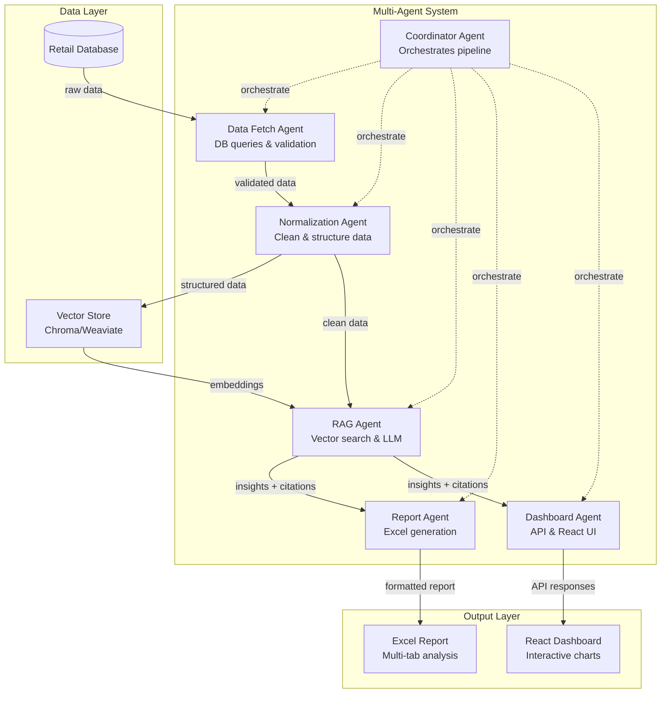

# Multi-Agent RAG PoC Build Plan

## System Architecture (Mermaid)



## Agent Specifications

| Agent | Input | Output | Tools | Retry Logic |
|-------|-------|---------|-------|-------------|
| **Coordinator** | Pipeline config, date range | Status updates, orchestration commands | Task queue, agent monitoring | 3 retries on agent failures |
| **Data Fetch** | Date range (90 days), DB connection | Raw returns/warranty records | SQL queries, DB connection pool | 5 retries with exponential backoff |
| **Normalization** | Raw data records | Cleaned, validated data structures | Data validation, schema mapping | 3 retries on validation errors |
| **RAG** | Normalized data, user queries | Insights with citations and confidence scores | Vector DB, LLM API, embedding model | 3 retries on LLM failures |
| **Report** | Insights, raw data, templates | Excel file with multiple tabs/charts | Excel libraries, chart generation | 2 retries on file generation |
| **Dashboard** | Insights, data summaries | JSON API responses, React components | REST API, chart.js integration | 3 retries on API failures |

## Message Contracts (JSON)

```json
// Coordinator → Data Fetch
{
  "type": "FETCH_DATA",
  "payload": {
    "date_range": {"start": "2024-05-20", "end": "2024-08-19"},
    "tables": ["returns", "warranties", "products"],
    "filters": {"store_locations": ["all"], "product_categories": ["all"]}
  }
}

// Data Fetch → Normalization  
{
  "type": "RAW_DATA",
  "payload": {
    "returns": [...], "warranties": [...], "products": [...],
    "metadata": {"record_count": 15000, "date_range": "...", "quality_score": 0.95}
  }
}

// Normalization → RAG
{
  "type": "CLEAN_DATA", 
  "payload": {
    "structured_data": {...},
    "embeddings_ready": true,
    "summary_stats": {"total_returns": 1200, "avg_resolution_time": "3.2 days"}
  }
}

// RAG → Report/Dashboard
{
  "type": "INSIGHTS",
  "payload": {
    "insights": [
      {
        "text": "Return rates increased 15% in electronics category",
        "confidence": 0.87,
        "citations": ["return_record_1234", "trend_analysis_chart"],
        "category": "trend_analysis"
      }
    ],
    "data_summaries": {...}
  }
}
```

## Database Schema & Seed Plan

```sql
-- Core Tables
CREATE TABLE returns (
    id SERIAL PRIMARY KEY,
    order_id VARCHAR(50),
    product_id VARCHAR(50),
    return_date DATE,
    reason VARCHAR(255),
    resolution_status VARCHAR(50),
    store_location VARCHAR(100),
    customer_id VARCHAR(50),
    amount DECIMAL(10,2)
);

CREATE TABLE warranties (
    id SERIAL PRIMARY KEY,
    product_id VARCHAR(50),
    claim_date DATE,
    issue_description TEXT,
    resolution_time_days INTEGER,
    status VARCHAR(50),
    cost DECIMAL(10,2)
);

CREATE TABLE products (
    id VARCHAR(50) PRIMARY KEY,
    name VARCHAR(255),
    category VARCHAR(100),
    price DECIMAL(10,2),
    brand VARCHAR(100)
);

-- Seed Data: Generate 90 days of realistic data
-- Returns: ~1000 records with seasonal patterns
-- Warranties: ~500 records with product correlation  
-- Products: ~200 SKUs across 5 categories
```

## RAG Design

- **Vector Store**: Chroma DB with persistent storage
- **Chunking Strategy**: 500-token chunks with 50-token overlap, semantic splitting on paragraphs
- **Embeddings**: OpenAI text-embedding-ada-002 or sentence-transformers
- **Retrieval**: Top-k=5 for context, cosine similarity threshold >0.7
- **Citations**: Track source chunks with metadata (table, record_id, date)
- **Context Window**: 4K tokens (3K context + 1K generation)

## Excel Report Specification

**Tab 1: Executive Summary**
- KPI cards: Total returns, avg resolution time, cost impact
- Trend charts: Returns over time, category breakdown
- Top issues table with severity rankings

**Tab 2: Category Analysis** 
- Pie charts: Returns by category, warranty claims distribution
- Bar charts: Resolution times by category
- Heatmap: Issues by product/time

**Tab 3: Detailed Data**
- Filterable tables: All returns and warranty records
- Pivot tables: Cross-tabulations by multiple dimensions

**Tab 4: AI Insights**
- Generated insights with confidence scores
- Citation references linking to raw data
- Recommended actions with priority levels

## API Endpoints & UI Widgets

**API Endpoints:**
- `GET /api/dashboard/summary` - KPI overview
- `GET /api/dashboard/trends?period=90d` - Time series data
- `GET /api/dashboard/insights` - RAG-generated insights
- `GET /api/reports/generate` - Trigger Excel generation
- `GET /api/reports/download/{id}` - Download Excel file

**React Widgets:**
- KPI Cards: Returns count, avg resolution, cost impact
- Line Chart: Returns trends over time (Chart.js)
- Bar Chart: Category breakdowns (Chart.js)  
- Data Table: Filterable/sortable insights list
- Citation Modal: Detailed source references

## Development Phases

**Phase 1: Foundation (2 weeks)**
- Database setup with seed data
- Basic agent framework and message passing
- Simple data fetch and normalization
- *Acceptance*: Can fetch and clean 90 days of data
- *Tests*: Unit tests for data pipeline, integration test for DB connection

**Phase 2: RAG Core (2 weeks)**  
- Vector store implementation and embedding
- RAG agent with basic insight generation
- Citation tracking system
- *Acceptance*: Generates insights with proper citations
- *Tests*: RAG quality tests, citation accuracy validation

**Phase 3: Output Generation (1.5 weeks)**
- Excel report generation with charts
- React dashboard with basic widgets
- API endpoint implementation
- *Acceptance*: Complete Excel + dashboard with real insights
- *Tests*: UI tests, report format validation

**Phase 4: Polish & Integration (0.5 weeks)**
- End-to-end pipeline testing
- Performance optimization
- Error handling and retries
- *Acceptance*: Full PoC demo-ready
- *Tests*: Load testing, error scenario validation

## Risks & Mitigations

**Risk 1: LLM API rate limits/costs**
- *Mitigation*: Implement caching, batch processing, fallback models

**Risk 2: Vector DB performance with large datasets**  
- *Mitigation*: Index optimization, data sampling for PoC

**Risk 3: Excel generation complexity**
- *Mitigation*: Use proven libraries (openpyxl), template-based approach

**Risk 4: Agent coordination failures**
- *Mitigation*: Robust retry logic, circuit breakers, status monitoring

## Configuration & Environment

```yaml
# config/agents.yaml
coordinators:
  max_concurrent_agents: 3
  timeout_seconds: 300

database:
  connection_pool_size: 10
  query_timeout: 30

rag:
  vector_store: "chroma"
  embedding_model: "text-embedding-ada-002"
  chunk_size: 500
  top_k: 5

excel:
  template_path: "templates/report_template.xlsx"
  max_file_size_mb: 50
```

## Performance Budgets

- **Data Processing**: <2 minutes for 90 days of data
- **RAG Queries**: <5 seconds per insight generation
- **Excel Generation**: <30 seconds for complete report
- **Dashboard Load**: <3 seconds initial page load
- **API Response**: <500ms for summary endpoints
- **Memory Usage**: <2GB peak during processing

## Design Rationale

This multi-agent architecture separates concerns for maintainability while enabling parallel processing and specialized optimization of each component. The RAG system uses semantic chunking and citation tracking to ensure insights are grounded and auditable, critical for business decision-making. The dual output approach (Excel for detailed analysis, React dashboard for interactive exploration) serves different stakeholder needs while maintaining data consistency through shared agent-generated insights.